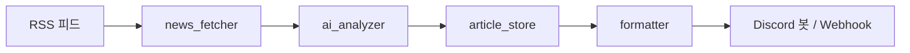

# Manchester United Daily News Bot

이 프로젝트는 RSS 피드를 통해 맨체스터 유나이티드 관련 뉴스를 수집하고, DeepSeek AI를 활용하여 요약한 뒤 디스코드 채널에 전송하는 자동화 봇입니다.

## 주요 기능

* **뉴스 수집**: Google News, The Guardian, BBC Sport의 RSS 피드에서 맨유 관련 최신 24시간 뉴스를 가져옵니다.
* **AI 요약 및 분류**: DeepSeek 모델을 사용하여 뉴스를 속보, 이적, 경기, 일반 카테고리로 분류하고 한국어로 요약합니다.
* **1티어 소스 강조**: Fabrizio Romano, David Ornstein 등 공신력이 높은 1티어 출처의 기사를 식별하여 특별히 강조 표시합니다.
* **디스코드 임베드**: 카테고리별 이모지와 색상을 적용한 Discord Embed 형식으로 가독성 좋게 메시지를 전송합니다.
* **자동화**: GitHub Actions를 통해 한국 시간 기준 매일 오전 7시에 뉴스를 자동으로 전송합니다.

## 설치 및 환경 설정

1. 패키지를 설치합니다.

```
pip install -r requirements.txt
```

개발·테스트 시:

```
pip install -r requirements-dev.txt
```

2. `.env` 파일을 생성하고 아래 환경 변수를 설정합니다. (`.env-example` 참고)

```env
DISCORD_TOKEN="YOUR_DISCORD_TOKEN"
DEEPSEEK_API_KEY="YOUR_DEEPSEEK_API_KEY"
CHANNEL_ID="YOUR_CHANNEL_ID"
```

## 실행 방법

### 일반 실행 (Discord 전송)

```
python main.py
```

### dry-run (Discord 없이 콘솔·JSON 확인)

```
python main.py --dry-run
python main.py --dry-run --output data/preview.json
```

환경 변수 `DRY_RUN=1`로도 활성화할 수 있습니다. AI 호출은 수행되며 Discord 전송·URL 기록은 하지 않습니다.

### Discord Webhook 전송

봇 토큰 대신 Webhook만 쓰려면:

```env
USE_DISCORD_WEBHOOK=1
DISCORD_WEBHOOK_URL=https://discord.com/api/webhooks/...
DEEPSEEK_API_KEY=...
```

## 테스트

```
pytest
```

`main` 실행 전 필수 값은 전송 방식에 따라 다릅니다.

| 모드 | 필수 환경 변수 |
|------|----------------|
| 기본 (봇) | `DISCORD_TOKEN`, `DEEPSEEK_API_KEY`, `CHANNEL_ID` |
| Webhook | `DISCORD_WEBHOOK_URL`, `USE_DISCORD_WEBHOOK=1`, `DEEPSEEK_API_KEY` |
| dry-run | `DEEPSEEK_API_KEY` |

push/PR 시 GitHub Actions(`ci.yml`)에서 자동으로 테스트가 실행됩니다.

## GitHub Actions

### 일일 뉴스 (`daily_news.yml`)

* 스케줄: UTC 22:00 (한국 시간 오전 7시)
* **수동 실행**: GitHub → Actions → Daily Man Utd News → Run workflow

필수 Secrets:

| Secret | 설명 |
|--------|------|
| `DISCORD_TOKEN` | 봇 토큰 |
| `DEEPSEEK_API_KEY` | DeepSeek API 키 |
| `CHANNEL_ID` | 전송 채널 ID |

선택 Secrets:

| Secret | 설명 |
|--------|------|
| `TEST_CHANNEL_ID` | 테스트 채널 ID (`USE_TEST_CHANNEL=1`과 함께) |
| `FAILURE_WEBHOOK_URL` | CI/일일 실행 실패 시 알림용 Discord Webhook |

### 1티어 속보 수동 실행 (`tier1_breaking.yml`)

Actions → **Tier1 Breaking News** → Run workflow  
`TIER1_ONLY=1`로 1티어 기사만 요약·전송합니다.

전송 URL 중복 방지용 `data/sent_urls.json`은 workflow cache로 유지됩니다.

### 실패 시 확인

1. Actions 로그에서 `ConfigError`, RSS, API 오류 메시지 확인
2. Secrets·채널 ID·봇 권한(메시지 전송) 점검
3. 로컬에서 `python main.py --dry-run`으로 AI·RSS만 검증

## 환경 변수

| 변수 | 기본값 | 설명 |
|------|--------|------|
| `RSS_URLS` | (내장 3개 피드) | 쉼표 또는 줄바꿈으로 RSS URL 목록 |
| `TIER_1_SOURCES` | (내장 5명) | 1티어 기자/매체명 목록 |
| `MAX_ARTICLES_PER_SOURCE` | `5` | 피드당 최대 기사 수 |
| `RSS_FETCH_TIMEOUT` | `10` | RSS 요청 타임아웃(초) |
| `DEEPSEEK_MODEL` | `deepseek-chat` | DeepSeek 모델명 |
| `SENT_URLS_PATH` | `data/sent_urls.json` | 전송한 기사 URL 저장 경로 |
| `SENT_URL_RETENTION_DAYS` | `7` | 중복 방지 기록 보관 일수 |
| `MAX_EMBEDS_PER_RUN` | `15` | 1회 실행당 최대 Embed 수 (1티어 우선) |
| `EMBED_SEND_DELAY_SEC` | `0.6` | Embed 전송 간격(초) |
| `TEST_CHANNEL_ID` | — | `USE_TEST_CHANNEL=1`일 때 사용할 채널 |
| `USE_TEST_CHANNEL` | — | `1`/`true`/`yes` 시 테스트 채널 사용 |
| `DISCORD_WEBHOOK_URL` | — | Webhook URL |
| `USE_DISCORD_WEBHOOK` | — | `1`이면 Webhook으로 전송 |
| `DRY_RUN` | — | `1`이면 dry-run |
| `DRY_RUN_OUTPUT_PATH` | `data/dry_run_briefing.json` | dry-run JSON 기본 경로 |
| `MAX_RAW_NEWS_CHARS` | `12000` | AI에 넘기는 뉴스 최대 글자 수 |
| `MAX_NEWS_BLOCKS_FOR_AI` | `20` | AI에 넘기는 최대 기사 블록 수 |
| `EMBED_LAYOUT` | `individual` | `individual` / `digest` / `tier1_split` |
| `TIER1_ONLY` | — | `1`이면 1티어 기사만 처리 |
| `FAILURE_WEBHOOK_URL` | — | Actions 실패 알림 Webhook |

## 데이터 흐름



로컬 품질 검사: `ruff check .` · `pytest`

개선 항목 추적: `IMPROVEMENTS_CHECKLIST.md`
